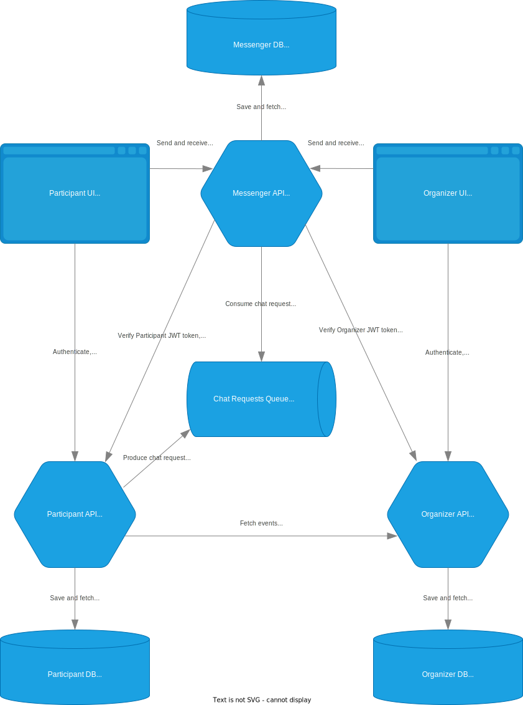
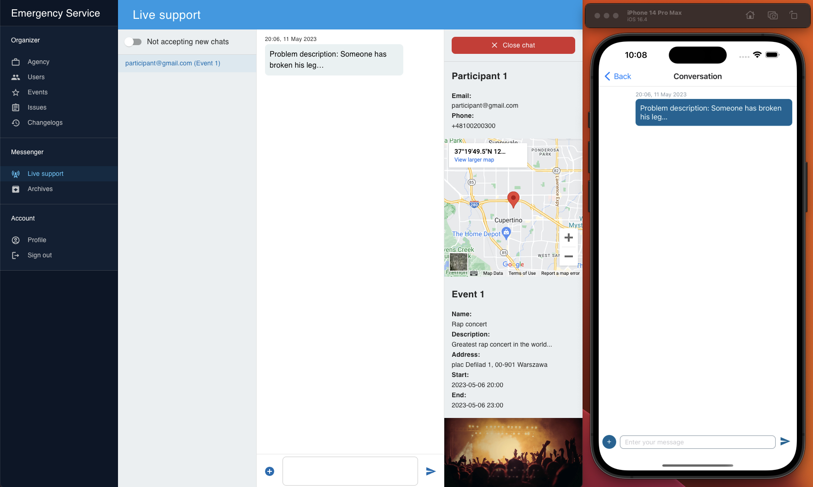

# Emergency Service for Mass Events

Engineering thesis by Wojciech Fabjańczuk under the supervision of mgr Piotr Gago.

## Description

Implemented emergency service allows the participants to request help on mass events and start chats with the organizers. 
Requests for help are put in the queue first so the organizers talk only to the number of participants they can handle in case of heavy application workload.
Being informed about the dangers, the organizers may send help or stop the event if necessary. Organizers can create issues for monitoring the incidents and review history of all conversations.

## Diagram

## Screens

